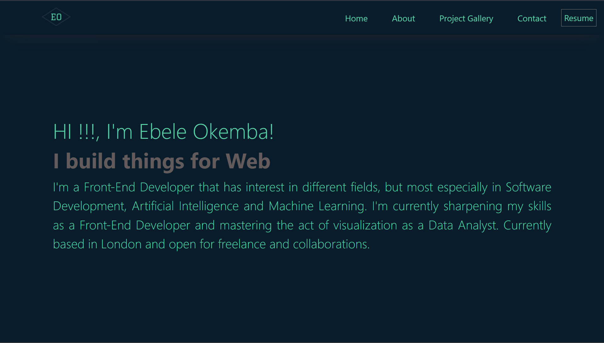

<!-- PROJECT TITLE -->

<h3 align="center">MY PORTFOLIO</h3>

 

<!-- TABLE OF CONTENTS -->

  
Table of Contents

  <ol>
    <li>
      <a href="#project-description"> Project Description</a>
      <ul>
        <li><a href="#built-with">Built With</a></li>
      </ul>
    </li>
    <li>
      <a href="#getting-started">Getting Started</a>
      <ul>
         <li><a href="#installation">Installation / Run Locally<</a></li>
        </ul>
    </li>
    <li><a href="#contributing">Contributing</a></li>
    <li><a href="#demo">Demo</a></li>
    <li><a href="#license">License</a></li>
    <li><a href="#question">Questions</a></li>
    </ol>

<!-- DESCRIPTION OF THE PROJECT -->
## Project Description

This project is basically design to to describe me as a brand while showcasing series of work that i had done. it also listed the technologies that i had worked with and a form & Social handles to contact me for work or refernce. 

### Built With

 * HTML
 * CSS
 * JAVASCRIPT
 * NODE.JS
 * ES6
 * React.js

<!-- GETTING STARTED -->
## Getting Started

Below is instruction on how to install the project locally to test is functionality.

### Installation
Follow the steps below to install this incridiable project:

1. Clone the repo
   'sh
   git clone 
   '
2. Install NPM packages
   'sh
   npm install
   '
3. Create React App
    'sh
    npx create-react-app choiceofName
    '

4. Replace the eexisting src with the project src

5. Install Bootstrap
    'sh
    npm i bootstrap
    '

6. Test Run the Project
    'sh
    npm start
    '

<!-- DEMO ON HOW THE PROJECT WORKS -->
## Demo

<!-- CONTRIBUTING -->
## Contributing

Contribution are always welcome, as it what make the open source community such an amazing place to learn, create and inspire. if you wish to contribute and make the project better, find below the step that  are to be followed to get started
1. Fork the Project
2. Create your Feature Branch ('git checkout -b feature/my_portfolio')
3. Commit your Changes ('git commit -m 'Add some changes my_portfolio'')
4. Push to the Branch ('git push origin feature/my_portfolio')
5. Open a Pull Request

<!-- LICENSE -->
## License

Distrubed under the 

<!-- QUESTIONS -->
## Questions

 Email : okemba50@gmail.com

 Profile : https://github.com/preshy59

Project Link: https://preshy59.github.io/my_portfolio/
